#Xiu签

* [Github](https://github.com/MISSZQ/XiuQian)
* [HostedRedmine](http://10.7.1.5/projects/android_xiu/wiki)

### 项目简介
  * Xiu签是一款以签到为主题的手机APP，它利用一些特色的活动吸引在校学生参加，帮助学生培养良好的生活学习习惯，同时也可以丰富学生的课余生活并且帮助他们结实一些志同道合的朋友。该APP的主要特色是用户可以自己发布一些活动，同时设置活动的相关属性，同时可以在活动中可以发表自己的签到感想，其它用户可以对其进行评论和点赞。
### 项目功能介绍
* 登录界面
  * 注册按钮：点击进入注册页面，进行用户注册
  * 用户头像：显示用户的头像（初始头像是默认头像）
  * 学号输入框：提示用户输入学号，长度为10位，且是数字
  * 密码输入框：提示用户输入密码，长度为0-20位，可以是数字、，密码、特殊符号
  * 记住密码单选框：用户勾选后，下次登录时将不用再次输入密码，系统自动记住密码
  * 自动登录单选框：用户勾选后，下次点开APP时将自动登录
  * 手机登录跳转：点击进入手机登录界面
  * 登录按钮：点击进入首页界面
* 注册界面
  * 注册按钮：点击按钮完成用户的注册
  * 用户头像：显示用户的头像，（初始头像是默认头像）
  * 学号输入框：提示用户输入学号，长度为10位，且是数字
  * 用户名输入框：提示用户输入用户名
  * 密码输入框：提示用户输入密码，长度为0-20位，可以是数字、，密码、特殊符号
  * 确认密码输入框：提示用户重新输入密码，确保两次输入的密码一致
  * 邮箱输入框：提示用户输入邮箱账号
* 手机登录界面
  * 返回按钮：点击该按钮返回登录用户密码登录界面
  * 注册按钮：点击按钮完成用户的注册
  * 产品的Logo:产品的创意Logo
  * 手机号输入框：提示使用手机登录的用户输入手机号，长度为11位，且必须是数字
  * 验证码输入框：提示用户输入手机收到的验证码
  * 发送验证码按钮：点击该按钮向用户手机发送一个验证码，如果用户在规定时间内没有进行输入，将会提示用户重新输入
  * 登录按钮：点击进入首页界面
* 热门活动（首页）界面
  * 用户头像：用户未登录时是空头像，用户登录后显示用户的头像，点击该头像可进入左侧信息栏界面
  * 添加活动按钮：点击进入活动创建界面
  * 活动下拉刷新：当向下拖拽界面时，会出现刷新动画，刷新完毕后会自动隐藏
  * 整体界面：显示活动的信息，包括名称、图像、描述等信息，点击活动后进入对应活动详情界面，向右滑动可进入左侧信息栏界面。
* 排行榜界面
  * 排行榜下拉框按钮：点击该按钮会出现最热活动、好评最多、签到排行三个排行方式
  * 最热活动排行：点击后显示当前最热活动排行，默认排行方式也是该方式，显示活动的图片、活动名称、点赞总数信息
  * 好评最多排行：点击后计入好评最多排行，显示用户的头像、名称、个人描述信息
  * 签到排行：点击后进入签到排行，显示用户头像、用户名称、用户某个活动的最多签到数
* 关注界面
  * 显示用户参加的活动，包括名称、图像、描述等信息，点击活动后进入对应活动详情界面
* 搜索界面
  * 搜索框：提示用户输入活动相关信息，当用户输入关键字后会显示与用户搜索相关的活动信息
  * 热门搜索：显示当前搜索最多的活动热词，点击后会进入活动的详情界面
* 左侧信息栏界面
  * 用户头像：当用户未登录时是空头像，用户点击将进入登录界面；当用户登录后将显示用户的头像，点击后进入用户的个人信息界面
  * 用户名称：当用户未登录时显示未登录，用户点击后进入登录界面；当用户登录后显示用户的名称，点击后进入用户个人信息界面
  * 下部信息栏：当用户未登录时，该栏不显示；用户登录后显示该信息栏
  * 我的签到：点击进入我的签到详情界面
  * 我的关注：点击进入我关注的用户界面
  * 我的活动：点击进入我创建的活动界面
  * 注销按钮：点击后用户退出登录，进入用户登录界面
* 用户个人信息界面
  * 信息修改按钮：点击后进入yoghurt信息修改界面
  * 用户头像：显示该用户的头像
  * 用户名称：显示该用户的名称
  * 用户签名：显示用户的签名信息
  * 信息展示栏：显示用户的关注数量、参加的活动数量、签到数信息
  * 签到动态信息：显示用户的签到信息，信息内容包括用户头像、名称、点赞数、参与活动名称、发表的感想
* 用户信息修改界面
  * 用户头像：显示用户的头像信息
  * 个性签名输入框：提示用户输入个性签名
  * 密码输入框：提示用户输入新的密码
  * 确认密码输入框：提示用户重新输入新的密码
  * 邮箱：提示用户输入新的邮箱信息
  * 确认修改按钮：点击后修改的信息被保存
* 创建活动界面
  * 活动标题输入框：提示用户输入活动标题
  * 活动内容输入框：提示用户输入该活动的主要内容
  * 私有活动选择按钮：可以选择该活动是否是私有活动
  * 活动开始日期：选择活动的开始日期
  * 活动结束日期：选择活动的结束日期
  * 惩罚模式选择按钮：可以选择该活动是否含有惩罚模式
  * 惩罚模式最晚签到时间：当该活动是惩罚模式的时候，选择最晚签到的时间
  * 惩罚模式惩罚措施：当该活动是惩罚模式的时候，选择惩罚措施
  * 限制人数：填写该活动的限制参加人数
  * 活动图片：添加活动的图片
* 活动详情显示界面
  * 关注按钮：点击后用户参加该活动
  * 活动图片：显示活动的图片信息
  * 活动描述：显示活动的描述信息
  * 活动创建者信息：显示该活动的创建者信息，包括头像、名称、创建日期信息
  * 参加活动用户显示：显示参加该活动的用户
  * 留言板：用户可以在该活动下进行留言
* 留言板界面
  * 评论显示：在评论信息上显示用户头像、用户名称、用户评论内容、评论时间、点赞按钮等信息
  * 点赞按钮：点击后对已经发表的评论进行点赞
  * 评论输入框：在此进行输入评论内容
  * 发表按钮：点击后进行评论发表
  * 点击评论进入用户信息页

### 项目成员
* 王寅达（项目经理、开发工程师）
  * Email: <1733220383@qq.com>
  * Github: [https://github.com/WindSul](https://github.com/WindSul)
* 高思雨（数据库工程师、开发工程师）
  * Email:<1060970075@qq.com>
  * Github:[https://github.com/siyu-gao](https://github.com/siyu-gao)
* 丁雪怡（UI设计师、开发工程师）
  * Email:<dingxueyidxy@foxmail.com>
  * Github:[https://github.com/dingxueyi](https://github.com/dingxueyi)
* 杨永昊（研发人员、开发工程师）
  * Email:<15531809228@sina.cn>
  * Github:[https://github.com/xiaoHaoZ1](https://github.com/xiaoHaoZ1)
* 王静楠（测试工程师）
  * Email:<18713923868@163.com>
  * Github:[https://github.com/wangjingnana](https://github.com/wangjingnana)
* 赵蕾（UI设计师、开发工程师）
  * Email:<455872507@qq.com>
  * Github:[https://github.com/zhaoleiZ](https://github.com/zhaoleiZ)
* 孙南（产品经理、开发工程师）
  * Email:<njsunnan@outlook.com>
  * Github:[https://github.com/MISSZQ](https://github.com/MISSZQ)
### 运行效果
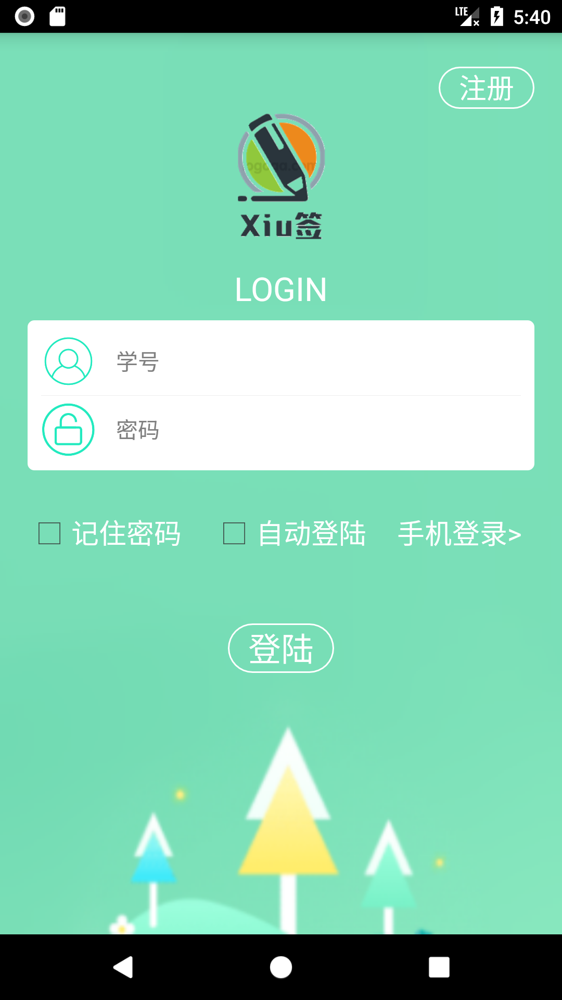           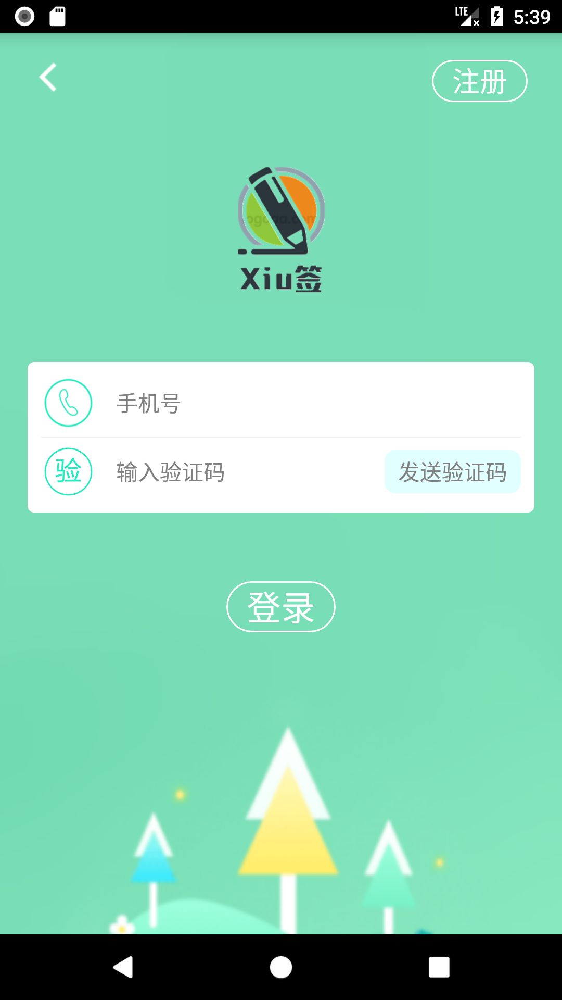
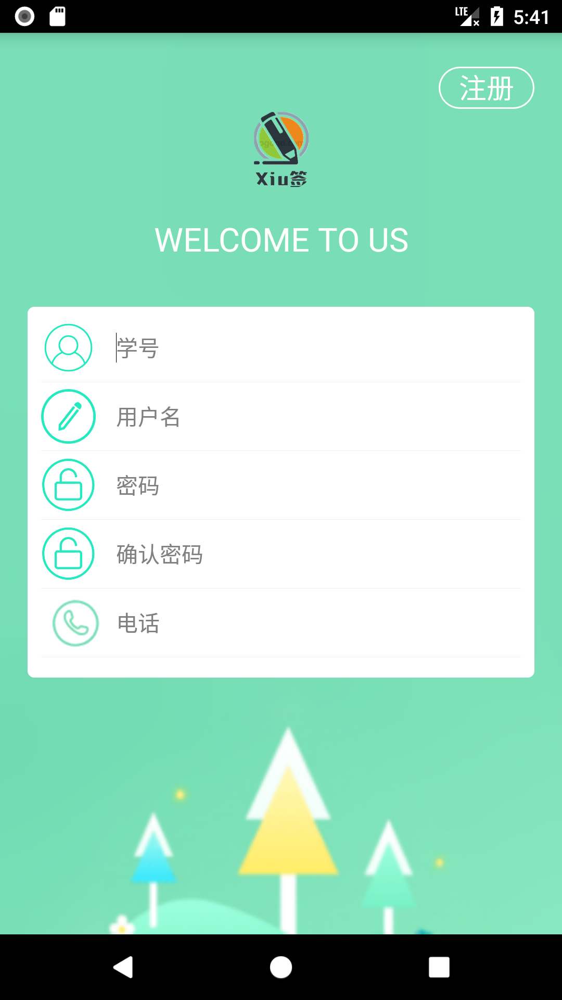           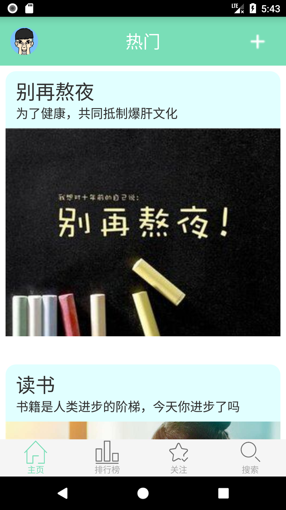
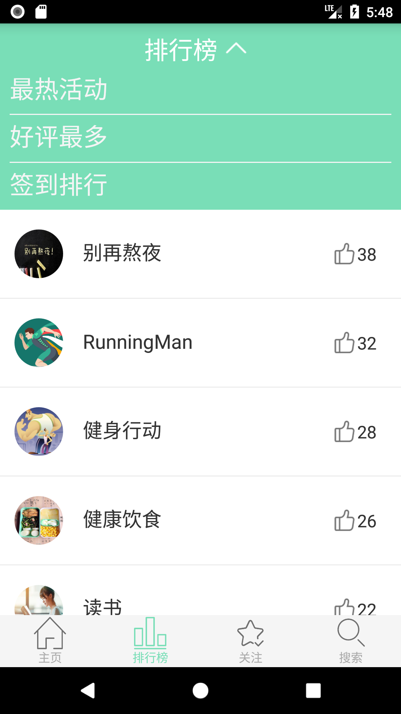           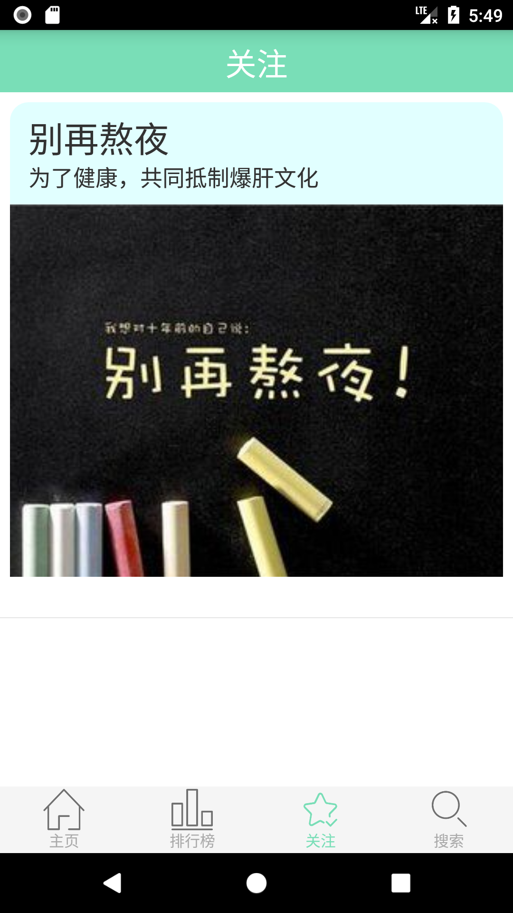
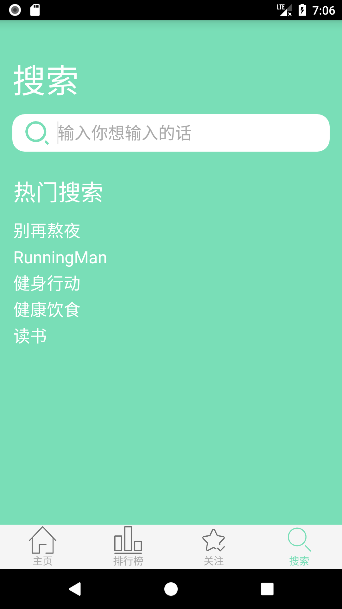           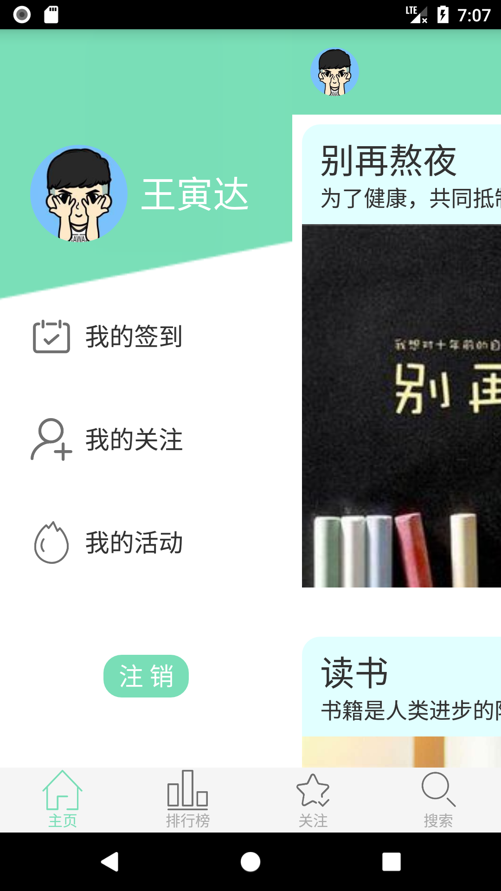
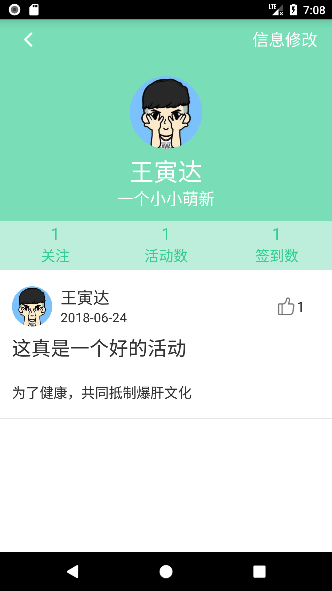           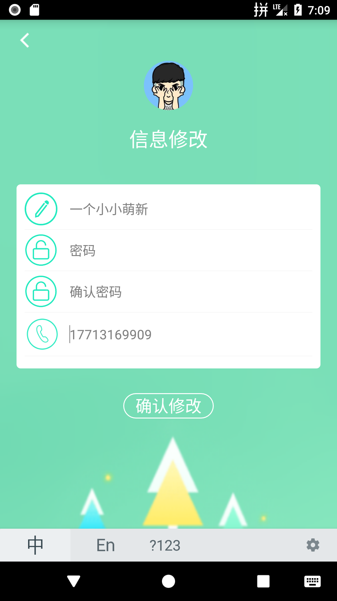
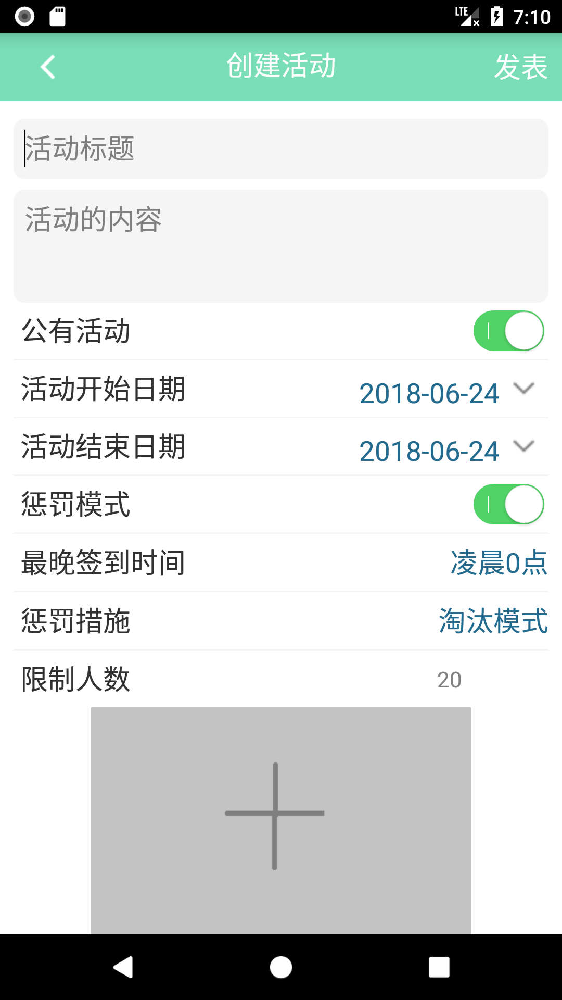          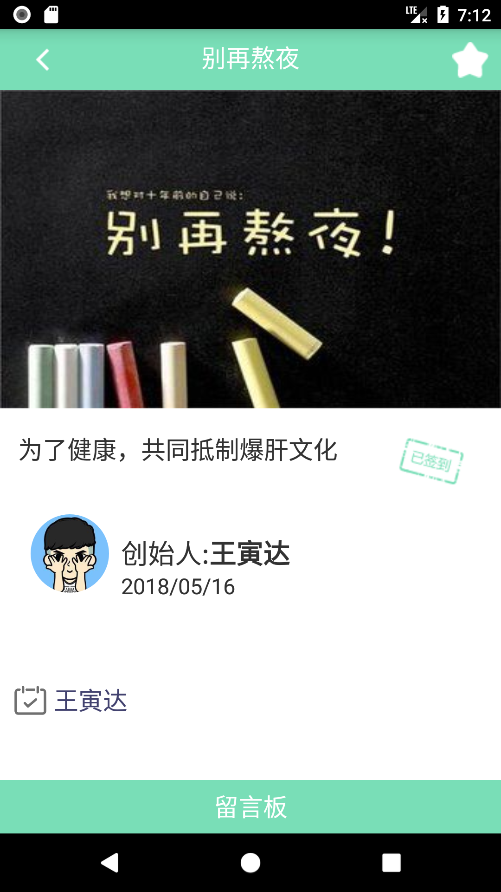
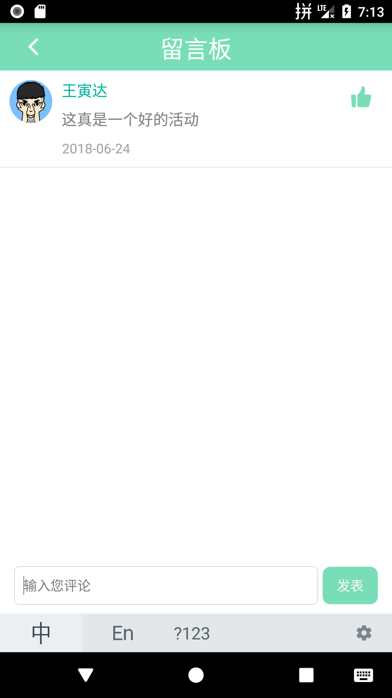          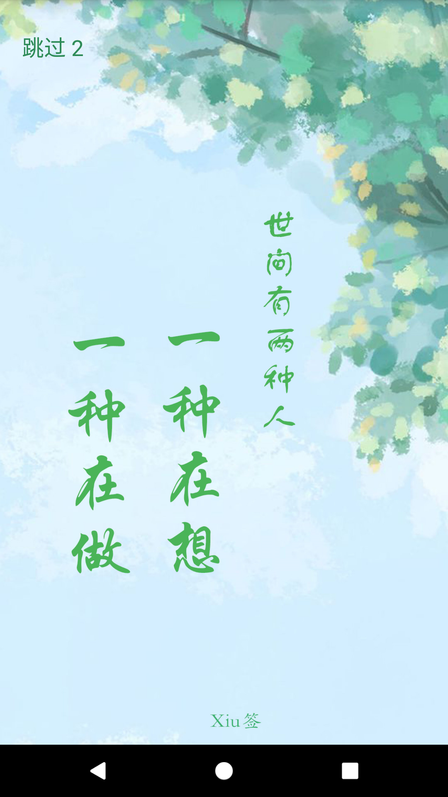
